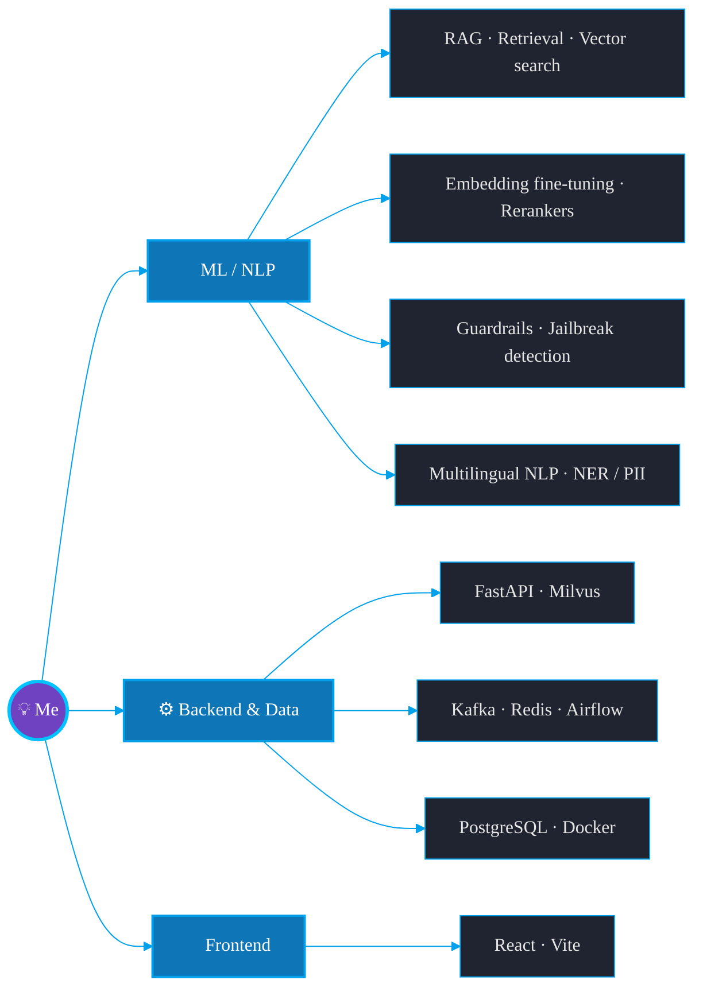

<!-- ===================== DECORATIVE BANNER ==================== -->

<!-- Name in plain markdown so it's readable on BOTH light & dark themes -->
<h1 align="center">Hi, I'm Ramazan 👋</h1>
<h3 align="center">ML / NLP Engineer — I build production AI systems</h3>

<!-- ===================== TYPING ANIMATION ===================== -->

  

<!-- ===================== SOCIAL + VIEWS ====================== -->

  
  
  
  

<!-- ===================== QUICK FACTS ========================= -->

  
  
  
  

---

<!-- ============================================================ -->
<!-- =================== SKILL GRAPH (compact) ================= -->
<!-- ============================================================ -->
### 🧬 What I do

---

<!-- ============================================================ -->
<!-- ========================= STACK ============================ -->
<!-- ============================================================ -->
### ⚡ Tech Stack

  
   
  
   
  
  
  
  
  

---

<!-- ============================================================ -->
<!-- ========================= STATS =========================== -->
<!-- ============================================================ -->
### 📊 Stats

  
  

  

