# Hi, I'm Ramazan

  
  
  
  

  
  
  

---

## Showcase

  

  

  

---

## What I Work With

```mermaid
%%{init: {'theme':'base','themeVariables':{'background':'#0b1220','primaryColor':'#132235','primaryTextColor':'#f4f7fb','primaryBorderColor':'#00C2FF','lineColor':'#7b2ff7','secondaryColor':'#0e75b6','tertiaryColor':'#0f172a'}}}%%
graph TD
    ME["What I work with"] --> A["ML / NLP"]
    ME --> B["LLM Systems"]
    ME --> C["Retrieval"]
    ME --> D["Backend"]
    ME --> E["Data Pipelines"]
    ME --> F["Databases"]
    ME --> G["Frontend"]
    ME --> H["Analytics"]

    A --> A1["Model training"]
    A --> A2["Fine-tuning"]
    A --> A3["Classification"]
    A --> A4["Anonymization"]

    B --> B1["Prompt design"]
    B --> B2["Routing"]
    B --> B3["Guardrails"]

    C --> C1["RAG pipelines"]
    C --> C2["Semantic search"]
    C --> C3["Embeddings"]

    D --> D1["API development"]
    D --> D2["Integrations"]
    D --> D3["Business logic"]

    E --> E1["Automation"]
    E --> E2["Parsing"]
    E --> E3["Synchronization"]

    F --> F1["Relational data"]
    F --> F2["Vector data"]
    F --> F3["Cache / session data"]

    G --> G1["Admin panels"]
    G --> G2["Internal tools"]
    G --> G3["SaaS interfaces"]

    H --> H1["Root-cause analysis"]
    H --> H2["Retrieval debugging"]
    H --> H3["Quality evaluation"]

    style ME fill:#7b2ff7,stroke:#00C2FF,stroke-width:3px,color:#ffffff
    style A fill:#0e75b6,stroke:#00C2FF,stroke-width:2px,color:#ffffff
    style B fill:#0e75b6,stroke:#00C2FF,stroke-width:2px,color:#ffffff
    style C fill:#0e75b6,stroke:#00C2FF,stroke-width:2px,color:#ffffff
    style D fill:#0e75b6,stroke:#00C2FF,stroke-width:2px,color:#ffffff
    style E fill:#0e75b6,stroke:#00C2FF,stroke-width:2px,color:#ffffff
    style F fill:#0e75b6,stroke:#00C2FF,stroke-width:2px,color:#ffffff
    style G fill:#0e75b6,stroke:#00C2FF,stroke-width:2px,color:#ffffff
    style H fill:#0e75b6,stroke:#00C2FF,stroke-width:2px,color:#ffffff
```

---

## Toolbox

  

  
  
  
  
  

---

  Open the profile showcase: <a href="https://github.com/Ramazanm1nd3R">github.com/Ramazanm1nd3R</a>

